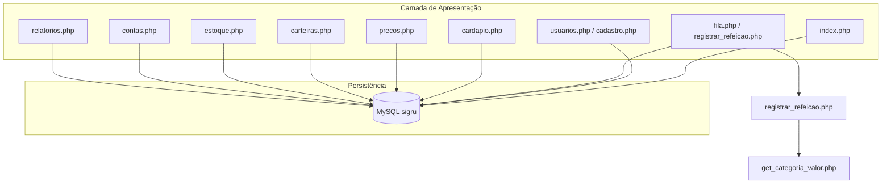
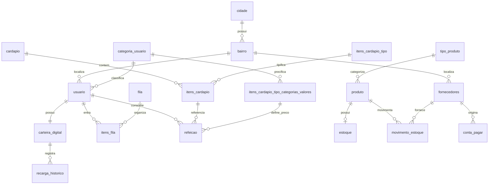
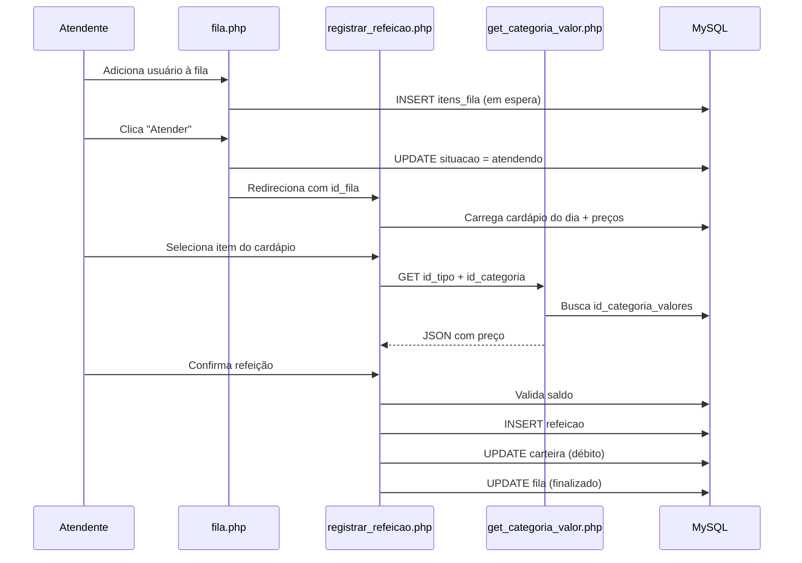

# SIGRU — Especificação Técnica do Sistema

**Versão:** 1.0  
**Sigla:** SIGRU — Sistema Integrado de Gerenciamento do Restaurante Universitário  
**Instituição:** Universidade Estadual de Montes Claros (Unimontes)  
**Curso:** Sistemas de Informação  
**Autores:** Luís Otávio de Souza e Silva, Matheus Gonçalves Dias  
**Data da especificação:** 23/06/2026

---

## Sumário

1. [Visão Geral](#1-visão-geral)
2. [Objetivos e Escopo](#2-objetivos-e-escopo)
3. [Stakeholders e Perfis de Usuário](#3-stakeholders-e-perfis-de-usuário)
4. [Arquitetura do Sistema](#4-arquitetura-do-sistema)
5. [Stack Tecnológica](#5-stack-tecnológica)
6. [Estrutura do Projeto](#6-estrutura-do-projeto)
7. [Modelo de Dados](#7-modelo-de-dados)
8. [Módulos e Funcionalidades](#8-módulos-e-funcionalidades)
9. [Fluxos de Negócio](#9-fluxos-de-negócio)
10. [Interface do Usuário](#10-interface-do-usuário)
11. [Regras de Negócio](#11-regras-de-negócio)
12. [Endpoints e Rotas](#12-endpoints-e-rotas)
13. [Configuração e Implantação](#13-configuração-e-implantação)
14. [Limitações Conhecidas](#14-limitações-conhecidas)
15. [Evoluções Futuras Sugeridas](#15-evoluções-futuras-sugeridas)

---

## 1. Visão Geral

O **SIGRU** é uma aplicação web desenvolvida para o gerenciamento operacional e administrativo do Restaurante Universitário (RU) da Unimontes. O sistema centraliza o controle de usuários frequentadores, fila virtual de atendimento, cardápio diário, precificação por categoria, carteiras digitais, estoque de insumos, contas a pagar/receber e relatórios gerenciais.

Trata-se de um projeto acadêmico com foco em demonstração de integração entre camada de apresentação (PHP/HTML/CSS/JS), persistência relacional (MySQL) e regras de negócio do contexto de um restaurante universitário.

### 1.1 Problema que o sistema resolve

| Problema | Solução no SIGRU |
|----------|------------------|
| Controle manual de filas no caixa | Fila virtual com estados (em espera → atendendo → finalizado) |
| Precificação diferenciada (aluno, bolsista, servidor, visitante) | Matriz de preços por tipo de item × categoria de usuário |
| Pagamento descentralizado | Carteira digital com recarga e débito automático na refeição |
| Falta de visibilidade do cardápio | Cadastro e exibição de cardápio por data e turno |
| Controle de insumos | Estoque com movimentações de entrada/saída |
| Gestão financeira básica | Contas a pagar/receber com indicadores consolidados |

---

## 2. Objetivos e Escopo

### 2.1 Objetivos

- Digitalizar o fluxo de atendimento no restaurante universitário.
- Permitir cadastro e gestão de usuários frequentadores com categorias diferenciadas.
- Automatizar cobrança de refeições via saldo em carteira digital.
- Oferecer painel gerencial com indicadores do dia (refeições, fila, caixa).
- Controlar estoque de mercadorias e movimentações.
- Registrar obrigações financeiras (contas a pagar e a receber).

### 2.2 Dentro do escopo (v1.0)

- Dashboard com métricas em tempo real
- CRUD de usuários
- Fila virtual e registro de refeições
- Gestão de cardápio
- Tabela de preços
- Carteiras digitais e recargas
- Estoque e movimentações
- Contas financeiras
- Relatórios filtráveis por período

### 2.3 Fora do escopo (v1.0)

- Autenticação e controle de acesso por funcionário
- Módulo web para receitas e fichas técnicas (tabelas existem no banco, sem interface)
- Módulo de cadastro de fornecedores e funcionários (dados apenas via seed)
- API REST completa
- Aplicativo mobile
- Integração com sistemas acadêmicos (SIGAA, etc.)
- Emissão de nota fiscal ou comprovante PDF

---

## 3. Stakeholders e Perfis de Usuário

### 3.1 Stakeholders

| Stakeholder | Interesse |
|-------------|-----------|
| Alunos e servidores da universidade | Acesso facilitado às refeições com preço subsidiado |
| Equipe do RU (atendentes, cozinha) | Organização da fila e registro de consumo |
| Nutricionista / gestão do cardápio | Planejamento do menu |
| Administração financeira do RU | Controle de caixa, contas e subsídios |
| Universidade (Unimontes) | Subsídio e repasse de recursos |

### 3.2 Categorias de usuário frequentador

Definidas na tabela `categoria_usuario`:

| Categoria | Descrição típica | Impacto no preço |
|-----------|------------------|------------------|
| Aluno | Estudante regular | Preço subsidiado padrão |
| Bolsista | Aluno com bolsa de alimentação | Preço mais baixo |
| Servidor | Funcionário da universidade | Preço intermediário |
| Visitante | Público externo | Preço integral |

### 3.3 Perfis de funcionário (modelo de dados)

A tabela `funcionario` armazena cargos e privilégios (`ESTOQUE`, `CARDAPIO`, `CAIXA`, `FILA`, `RELATORIOS`, `TOTAL`), porém **não há tela de login nem enforcement de permissões** na versão atual. O sistema opera como painel administrativo aberto.

---

## 4. Arquitetura do Sistema

### 4.1 Padrão arquitetural

**Monolito server-side** com arquitetura em camadas simplificada:

```
┌─────────────────────────────────────────────────────────┐
│                    NAVEGADOR (Cliente)                     │
│              HTML5 + CSS3 + JavaScript                   │
└─────────────────────────┬───────────────────────────────┘
                          │ HTTP (GET/POST)
┌─────────────────────────▼───────────────────────────────┐
│                  Apache (XAMPP)                          │
│  ┌─────────────────────────────────────────────────┐    │
│  │  Páginas PHP (*.php) — Controller + View        │    │
│  │  includes/header.php, footer.php, db.php        │    │
│  └─────────────────────┬───────────────────────────┘    │
└────────────────────────┼────────────────────────────────┘
                         │ mysqli
┌────────────────────────▼────────────────────────────────┐
│                   MySQL 8.0+ (banco sigru)                 │
└────────────────────────────────────────────────────────────┘
```

### 4.2 Características

- **Sem framework PHP** (código procedural com includes).
- **Sem ORM** — queries SQL diretas via `mysqli`.
- **Sem camada de serviço separada** — lógica de negócio embutida nas páginas.
- **Sem roteador** — cada funcionalidade é um arquivo `.php` na raiz.
- **Conexão centralizada** em `includes/db.php` via função `getConnection()`.

### 4.3 Diagrama de módulos



---

## 5. Stack Tecnológica

| Camada | Tecnologia | Versão/Observação |
|--------|------------|-------------------|
| Linguagem backend | PHP | 7.4+ (usa `match` expression) |
| Banco de dados | MySQL | 8.0+ |
| Servidor web | Apache | via XAMPP |
| Markup | HTML5 | Semântico básico |
| Estilização | CSS3 | Custom properties, layout flex/grid |
| Ícones | Tabler Icons | CDN 3.10.0 |
| JavaScript | Vanilla JS | Abas, modais, fila dinâmica de cardápio, fetch AJAX |
| Ambiente local | XAMPP | Windows (documentado no README) |
| Charset | utf8mb4 | Configurado na conexão |

### 5.1 Dependências externas (CDN)

- `@tabler/icons-webfont@3.10.0` — ícones da interface

Não há `composer.json`, `package.json` ou gerenciador de dependências PHP/JS local.

---

## 6. Estrutura do Projeto

```
sigru_app/
├── assets/
│   └── css/
│       └── style.css          # Design system e componentes visuais
├── database/
│   ├── sigru_create.sql       # Criação das tabelas (Dicionário de Dados — Seminário I)
│   └── sigru_seed.sql         # Povoamento com dados fictícios para demonstração
├── includes/
│   ├── conexao.php            # Conexão mysqli direta (legado, não usado pelas páginas)
│   ├── db.php                 # Conexão via getConnection() — padrão atual
│   ├── header.php             # Layout: sidebar, topbar, navegação
│   └── footer.php             # Fechamento do layout HTML
├── index.php                  # Dashboard
├── usuarios.php               # Listagem e exclusão de usuários
├── cadastro.php               # Cadastro de novo usuário
├── editar_usuario.php         # Edição de usuário
├── fila.php                   # Fila virtual
├── registrar_refeicao.php     # Registro de refeição (caixa)
├── get_categoria_valor.php    # API JSON auxiliar para preços
├── cardapio.php               # Gestão de cardápio
├── precos.php                 # Matriz de preços
├── carteiras.php              # Carteiras digitais e recargas
├── estoque.php                # Estoque e movimentações
├── contas.php                 # Contas a pagar e receber
├── relatorios.php             # Relatórios gerenciais
├── README.md                  # Documentação básica de instalação
└── spec.md                    # Este documento
```

---

## 7. Modelo de Dados

O banco `sigru` é definido em `database/sigru_create.sql` (24 tabelas, constraints nomeadas, tamanhos conforme o **Dicionário de Dados do Seminário I**) e populado por `database/sigru_seed.sql`. Ambos estão **alinhados com a aplicação PHP**.

**Ordem de importação:** `sigru_create.sql` → `sigru_seed.sql`

### 7.1 Inventário de tabelas

| # | Tabela | Nível |
|---|--------|-------|
| 1 | `cidade` | Base |
| 2 | `bairro` | Base |
| 3 | `categoria_usuario` | Base |
| 4 | `tipo_produto` | Base |
| 5 | `itens_cardapio_tipo` | Base |
| 6 | `cardapio` | Base |
| 7 | `fila` | Base |
| 8 | `funcionario` | Chave natural (CPF) |
| 9 | `fornecedores` | Chave natural (CNPJ) |
| 10 | `usuario` | Dependente |
| 11 | `produto` | Dependente |
| 12 | `itens_cardapio` | Dependente |
| 13 | `itens_cardapio_tipo_categorias_valores` | Dependente |
| 14 | `carteira_digital` | Dependente |
| 15 | `estoque` | Associativa |
| 16 | `movimento_estoque` | Associativa |
| 17 | `receita` | Associativa |
| 18 | `conta_receber` | Associativa |
| 19 | `itens_cardapio_receita` | Associativa |
| 20 | `itens_receita_produto` | Associativa |
| 21 | `itens_fila` | Associativa |
| 22 | `refeicao` | Associativa |
| 23 | `recarga_historico` | Associativa |
| 24 | `conta_pagar` | Associativa |

### 7.2 Diagrama entidade-relacionamento



### 7.3 Tabelas principais

#### Localização

| Tabela | Campos principais | Descrição |
|--------|-------------------|-----------|
| `cidade` | `id_cidade`, `descricao`, `uf`, `codigo_ibge` | Municípios |
| `bairro` | `id_bairro`, `id_cidade`, `descricao` | Bairros vinculados à cidade |

#### Usuários e carteira

| Tabela | Campos principais | Descrição |
|--------|-------------------|-----------|
| `categoria_usuario` | `id_categoria`, `descricao` | Aluno, Bolsista, Servidor, Visitante |
| `usuario` | `id_usuario`, `matricula`, `nome_completo`, `id_categoria`, `id_bairro`, `endereco` | Frequentador do RU |
| `carteira_digital` | `id_carteira`, `id_usuario`, `saldo` | Saldo virtual para pagamento |
| `recarga_historico` | `id_recarga`, `id_carteira`, `valor`, `data` | Histórico de recargas |

#### Cardápio e preços

| Tabela | Campos principais | Descrição |
|--------|-------------------|-----------|
| `cardapio` | `id_cardapio`, `data_servico`, `turno` | Cardápio por data (Almoço/Jantar) |
| `itens_cardapio_tipo` | `id_tipo`, `descricao` | Tipos: Prato Livre, Marmitex, etc. |
| `itens_cardapio` | `id_itens_cardapio`, `id_cardapio`, `id_tipo`, `descricao` | Itens do cardápio |
| `itens_cardapio_tipo_categorias_valores` | `id_categoria_valores`, `id_tipo`, `id_categoria`, `valor` | Preço por tipo × categoria |

#### Fila e refeições

| Tabela | Campos principais | Descrição |
|--------|-------------------|-----------|
| `fila` | `id_fila`, `tipo_fila` | Preferencial, Prato, Marmitex |
| `itens_fila` | `id_itens_fila`, `id_usuario`, `id_fila`, `horario_inscricao`, `situacao` | Posição na fila |
| `refeicao` | `id_refeicao`, `id_usuario`, `id_itens_cardapio`, `id_categoria_valores`, `valor`, `horario_entrada`, `horario_saida` | Consumo registrado |

**Estados da fila (`itens_fila.situacao`):**

| Estado | Descrição |
|--------|-----------|
| `em espera` | Usuário aguardando atendimento |
| `atendendo` | Em processo de registro de refeição |
| `finalizado` | Atendimento concluído |

#### Estoque

| Tabela | Campos principais | Descrição |
|--------|-------------------|-----------|
| `tipo_produto` | `id_tipo`, `descricao_tipo` | Carnes, Laticínios, Hortifruti, etc. |
| `produto` | `id_produto`, `nome_produto`, `unidade_medida`, `id_tipo_produto` | Mercadorias (KG, LT, UN, CX, PT) |
| `estoque` | `id_estoque`, `quantidade`, `data_atualizacao`, `id_produto` | Saldo atual por produto |
| `movimento_estoque` | `id_movimento`, `tipo_movimento`, `quantidade_mov`, `data_movimento`, `id_produto`, `cnpj_fornecedor` | ENTRADA ou SAIDA |
| `fornecedores` | `cnpj`, `razao_social`, `telefone`, `id_bairro`, `endereco` | Fornecedores de insumos |

#### Financeiro

| Tabela | Campos principais | Descrição |
|--------|-------------------|-----------|
| `conta_pagar` | `id_conta_pagar`, `valor`, `data_vencimento`, `status`, `origem`, `cnpj_fornecedor` | Obrigações (PENDENTE/PAGO) |
| `conta_receber` | `id_conta_receber`, `valor`, `data_prevista`, `origem` | Receitas previstas |

**Origens de conta a pagar:** `FORNECEDOR`, `CEMIG`, `COPASA`, `MANUTENCAO`, `OUTROS`

#### Tabelas no banco sem interface (v1.0)

| Tabela | Finalidade |
|--------|------------|
| `funcionario` | `cpf`, `nome_funcionario`, `cargo`, `privilegios` — equipe do RU |
| `receita` | Fichas de preparo |
| `itens_receita_produto` | Ingredientes por receita |
| `itens_cardapio_receita` | Receitas vinculadas ao cardápio |

### 7.4 Exemplo de precificação (dados seed)

| Tipo de item | Aluno | Bolsista | Servidor | Visitante |
|--------------|-------|----------|----------|-----------|
| Prato Livre | R$ 8,50 | R$ 2,00 | R$ 13,00 | R$ 17,00 |
| Marmitex | R$ 12,00 | R$ 6,00 | R$ 16,00 | R$ 20,00 |
| Marmitex Fit | R$ 14,00 | — | R$ 18,00 | R$ 22,00 |
| Marmitex Vegetariano | R$ 13,00 | — | R$ 17,00 | — |
| Sobremesa | R$ 3,00 | R$ 1,00 | R$ 4,00 | R$ 5,00 |

Células vazias indicam combinação sem preço definido — o sistema impede registro de refeição nesses casos.

---

## 8. Módulos e Funcionalidades

### 8.1 Dashboard (`index.php`)

**Propósito:** Visão operacional do dia.

| Indicador | Fonte |
|-----------|-------|
| Usuários cadastrados | `COUNT(usuario)` |
| Refeições hoje | `refeicao` com `DATE(horario_entrada) = CURDATE()` |
| Em fila agora | `itens_fila` com `situacao = 'em espera'` |
| Caixa do dia | `SUM(valor)` das refeições de hoje |

**Widgets adicionais:**
- Cardápio do dia agrupado por turno
- Estoque com alerta de quantidade baixa (< 80 unidades)
- Últimas 6 refeições registradas

### 8.2 Usuários

| Arquivo | Operações |
|---------|-----------|
| `usuarios.php` | Listar (com saldo da carteira), excluir |
| `cadastro.php` | Criar usuário + carteira digital com saldo R$ 0,00 |
| `editar_usuario.php` | Atualizar matrícula, nome, categoria, bairro, endereço |

**Campos obrigatórios no cadastro:** matrícula/SIAPE, nome completo, categoria, bairro, endereço.

### 8.3 Fila Virtual (`fila.php`)

| Ação | Comportamento |
|------|---------------|
| Adicionar à fila | Impede duplicata se usuário já está `em espera` |
| Atender | Altera situação para `atendendo` e redireciona para registro |
| Registrar refeição | Link para `registrar_refeicao.php` quando `atendendo` |
| Remover | Exclui registro da fila (exceto finalizados) |

**Tipos de fila:** Preferencial, Prato, Marmitex.

### 8.4 Registro de Refeição (`registrar_refeicao.php`)

Fluxo central de cobrança:

1. Carrega dados do usuário em atendimento (categoria, saldo, tipo de fila).
2. Lista itens do cardápio de **hoje** com preço calculado para a categoria do usuário.
3. Usuário seleciona item → JavaScript consulta `get_categoria_valor.php` para obter `id_categoria_valores`.
4. Ao confirmar:
   - Valida saldo suficiente
   - Insere em `refeicao`
   - Debita `carteira_digital.saldo`
   - Marca fila como `finalizado`

### 8.5 Cardápio (`cardapio.php`)

| Funcionalidade | Detalhe |
|----------------|---------|
| Criar cardápio | Data + turno + múltiplos itens (tipo + descrição opcional) |
| Reutilizar cardápio | Se já existe cardápio para data+turno, adiciona itens ao existente |
| Listar | Agrupado por data/turno, destaque para "Hoje" |
| Excluir | Item individual ou cardápio completo |

Interface com JavaScript para adicionar/remover linhas de itens dinamicamente.

### 8.6 Preços (`precos.php`)

| Funcionalidade | Detalhe |
|----------------|---------|
| Matriz visual | Tipos de item (linhas) × categorias (colunas) |
| Edição inline | Modal para definir/atualizar preço |
| Upsert | INSERT ou UPDATE conforme combinação existente |
| Novo tipo | Cadastro de tipos de item de cardápio |
| Exclusão | Remove preço de uma combinação |

### 8.7 Carteiras (`carteiras.php`)

| Funcionalidade | Detalhe |
|----------------|---------|
| Recarga | Incrementa saldo + registra em `recarga_historico` |
| Ajuste manual | Correção direta do saldo (sem histórico de recarga) |
| Listagem | Saldo com status visual (sem saldo / baixo / OK) |
| Histórico | Últimas 20 recargas |

**Limites visuais de saldo:**
- ≤ R$ 0,00 → Sem saldo (vermelho)
- < R$ 10,00 → Saldo baixo (âmbar)
- ≥ R$ 10,00 → OK (verde)

### 8.8 Estoque (`estoque.php`)

**Aba 1 — Cadastrar mercadoria:**
- Nome, categoria (`tipo_produto`), unidade, quantidade inicial opcional
- Cria produto, registro de estoque e movimentação ENTRADA se qtd > 0

**Aba 2 — Movimentação:**
- ENTRADA: incrementa estoque (fornecedor opcional)
- SAIDA: decrementa estoque com validação de quantidade disponível

**Indicadores de status:**
- 0 → Zerado
- < 80 → Baixo
- ≥ 80 → OK

### 8.9 Contas (`contas.php`)

**Contas a pagar:**
- Cadastro com origem, valor, vencimento, fornecedor (se FORNECEDOR)
- Marcar como PAGO / Reabrir (PENDENTE)
- Status visual: Pago, Pendente, Vencida

**Contas a receber:**
- Cadastro com origem, valor, data prevista
- Exclusão

**Métricas:** total pendente, total pago, total a receber, saldo previsto (receber − pendente).

### 8.10 Relatórios (`relatorios.php`)

Filtro por período (data inicial/final) com atalhos: Hoje, 7 dias, 30 dias, Este mês.

| Relatório | Critério de filtro |
|-----------|-------------------|
| Refeições por categoria | `horario_entrada` no período |
| Contas a pagar pendentes | `data_vencimento` no período |
| Saldo das carteiras | Momento atual (ignora filtro) |
| Contas a receber | `data_prevista` no período |
| Movimentações de estoque | `data_movimento` no período |

---

## 9. Fluxos de Negócio

### 9.1 Fluxo completo de atendimento



### 9.2 Fluxo de recarga de carteira

1. Atendente seleciona usuário e valor em `carteiras.php`
2. Sistema cria carteira se não existir
3. Incrementa saldo
4. Registra em `recarga_historico` com timestamp

### 9.3 Fluxo de movimentação de estoque

1. Seleciona produto, tipo (ENTRADA/SAIDA) e quantidade
2. Para SAIDA: valida estoque ≥ quantidade
3. Insere em `movimento_estoque`
4. Atualiza ou cria registro em `estoque`

---

## 10. Interface do Usuário

### 10.1 Layout

- **Sidebar fixa** (220px) com navegação em roxo escuro (`--purple-900`)
- **Topbar** com título da página e data atual
- **Área de conteúdo** com cards, tabelas e formulários
- **Responsivo básico** via CSS Grid/Flexbox

### 10.2 Design system (`assets/css/style.css`)

| Token | Valor | Uso |
|-------|-------|-----|
| `--purple-600` | #534AB7 | Ações primárias, destaques |
| `--teal-600` | #0F6E56 | Valores positivos, entradas |
| `--red-600` | #A32D2D | Alertas, saídas, sem saldo |
| `--amber-600` | #854F0B | Pendências, estoque baixo |

**Componentes reutilizáveis:**
- `.card`, `.metric-card`, `.metric-grid`
- `.btn` (primary, secondary, danger, sm)
- `.pill` (purple, green, amber, red, gray, teal)
- `.alert` (success, error)
- `.form-grid`, `.table-wrap`
- `.report-row`

### 10.3 Navegação principal

| Rota | Label | Ícone |
|------|-------|-------|
| `index.php` | Dashboard | ti-layout-dashboard |
| `usuarios.php` | Usuários | ti-users |
| `cadastro.php` | Cadastrar usuário | ti-user-plus |
| `fila.php` | Fila virtual | ti-list-numbers |
| `cardapio.php` | Cardápio | ti-clipboard-list |
| `estoque.php` | Estoque | ti-package |
| `carteiras.php` | Carteiras | ti-wallet |
| `contas.php` | Contas | ti-receipt |
| `precos.php` | Preço das refeições | ti-currency-dollar |
| `relatorios.php` | Relatórios | ti-chart-bar |

---

## 11. Regras de Negócio

### 11.1 Usuários

- RN-01: Ao cadastrar usuário, uma carteira digital com saldo zero é criada automaticamente.
- RN-02: Matrícula/SIAPE deve ser única (constraint de banco).
- RN-03: Exclusão de usuário remove registro; integridade referencial pode impedir se houver refeições/fila vinculadas.

### 11.2 Fila

- RN-04: Um usuário não pode estar em mais de uma posição `em espera` simultaneamente.
- RN-05: Posição na fila é exibida apenas para `em espera` e `atendendo`.
- RN-06: Ordenação: atendendo → em espera → finalizado, depois por horário de inscrição.

### 11.3 Refeições

- RN-07: Só é possível registrar refeição para cardápio do dia atual (`CURDATE()`).
- RN-08: Preço é determinado pela combinação tipo de item × categoria do usuário.
- RN-09: Registro bloqueado se saldo da carteira < valor da refeição.
- RN-10: Registro bloqueado se não houver preço definido para a combinação.
- RN-11: Ao registrar refeição, o saldo é debitado atomicamente (sem transação explícita).

### 11.4 Cardápio

- RN-12: Um cardápio é identificado unicamente por data + turno.
- RN-13: Novos itens podem ser adicionados a cardápio existente do mesmo dia/turno.

### 11.5 Estoque

- RN-14: Saída não pode exceder quantidade em estoque.
- RN-15: Movimentação ENTRADA com quantidade inicial ao cadastrar produto gera histórico.

### 11.6 Financeiro

- RN-16: Conta a pagar nasce com status `PENDENTE`.
- RN-17: Conta vencida = pendente com `data_vencimento` anterior à data atual.
- RN-18: Saldo previsto = total a receber − total pendente a pagar.

### 11.7 Carteira

- RN-19: Recarga exige valor > 0.
- RN-20: Ajuste manual de saldo não gera entrada em `recarga_historico`.

---

## 12. Endpoints e Rotas

### 12.1 Páginas web (GET/POST)

| Método | Rota | Parâmetros | Ação |
|--------|------|------------|------|
| GET | `/index.php` | — | Dashboard |
| GET | `/usuarios.php` | `excluir`, `msg` | Listar / excluir |
| GET/POST | `/cadastro.php` | POST: dados do usuário | Cadastrar |
| GET/POST | `/editar_usuario.php` | `id` | Editar |
| GET/POST | `/fila.php` | POST: adicionar; GET: atender, excluir | Gerenciar fila |
| GET/POST | `/registrar_refeicao.php` | `id_fila` | Registrar refeição |
| GET/POST | `/cardapio.php` | POST: novo_cardapio; GET: excluir | Cardápio |
| GET/POST | `/precos.php` | POST: salvar_preco, novo_tipo; GET: excluir | Preços |
| GET/POST | `/carteiras.php` | POST: recarregar, ajustar | Carteiras |
| GET/POST | `/estoque.php` | POST: novo_produto, movimentar | Estoque |
| GET/POST | `/contas.php` | POST: nova_pagar, nova_receber; GET: pagar, reabrir, excluir | Contas |
| GET | `/relatorios.php` | `data_inicio`, `data_fim` | Relatórios |

### 12.2 API auxiliar (JSON)

**`GET /get_categoria_valor.php`**

| Parâmetro | Tipo | Obrigatório | Descrição |
|-----------|------|-------------|-----------|
| `id_tipo` | int | Sim | ID do tipo de item de cardápio |
| `id_categoria` | int | Sim | ID da categoria do usuário |

**Resposta de sucesso:**
```json
{
  "id_categoria_valores": 1,
  "valor": "8.50"
}
```

**Resposta quando não encontrado:**
```json
{
  "id_categoria_valores": null
}
```

---

## 13. Configuração e Implantação

### 13.1 Pré-requisitos

- XAMPP (Apache + MySQL + PHP 7.4+)
- MySQL 8.0+
- Navegador moderno com suporte a Fetch API

### 13.2 Instalação

1. Clonar repositório em `C:\xampp\htdocs\sigru_app`
2. Iniciar Apache e MySQL no XAMPP
3. Importar os scripts SQL **nesta ordem**:
   - `database/sigru_create.sql` — cria e recria o banco `sigru` com todas as tabelas
   - `database/sigru_seed.sql` — popula com dados fictícios (usa `CURDATE()` para cardápios)
4. Configurar credenciais em `includes/db.php`:

```php
define('DB_HOST', 'localhost');
define('DB_USER', 'root');
define('DB_PASS', '');
define('DB_NAME', 'sigru');
```

5. Acessar `http://localhost/sigru_app`

> A conexão PHP define `utf8mb4` em `getConnection()`. O script de criação usa `CREATE DATABASE sigru` sem charset explícito; em produção, recomenda-se `utf8mb4_unicode_ci`.

### 13.3 Configuração de conexão

| Arquivo | Uso |
|---------|-----|
| `includes/db.php` | **Ativo** — função `getConnection()` usada por todas as páginas |
| `includes/conexao.php` | Legado — conexão direta em variável `$conn`, não referenciada |

---

## 14. Limitações Conhecidas

### 14.1 Segurança

| Limitação | Risco | Detalhe |
|-----------|-------|---------|
| Sem autenticação | Alto | Qualquer pessoa com acesso à URL pode operar o sistema |
| SQL injection parcial | Alto | IDs numéricos interpolados diretamente; strings usam `real_escape_string` |
| Sem CSRF token | Médio | Formulários vulneráveis a requisições cross-site |
| Sem HTTPS obrigatório | Médio | Ambiente local apenas |

### 14.2 Integridade de dados

| Limitação | Detalhe |
|-----------|---------|
| Sem transações SQL | Débito de carteira e insert de refeição não são atômicos |
| `conexao.php` duplicado | Duas formas de conexão coexistem |
| Inconsistências de tipo no DDL | Ex.: `itens_cardapio_receita` referencia `INT(6)` com colunas `INT(5)` |

### 14.3 Funcional

| Limitação | Detalhe |
|-----------|---------|
| Sem módulo de receitas | Tabelas populadas no seed, sem CRUD |
| Sem gestão de fornecedores/funcionários | Apenas dados seed |
| `horario_saida` nunca preenchido | Refeições ficam "Em curso" no dashboard |
| Sem paginação | Listagens carregam todos os registros |
| Sem busca/filtro em listas | Exceto relatórios com filtro de data |

---

## 15. Evoluções Futuras Sugeridas

### Prioridade alta
- [ ] Sistema de login com perfis de funcionário e enforcement de privilégios
- [ ] Prepared statements em todas as queries
- [ ] Transações SQL no fluxo de registro de refeição

### Prioridade média
- [ ] Interface CRUD para fornecedores e funcionários
- [ ] Módulo de receitas e fichas técnicas com impacto automático no estoque
- [ ] Registro de `horario_saida` ao finalizar refeição
- [ ] Exportação de relatórios (PDF/CSV)
- [ ] Paginação e busca nas listagens

### Prioridade baixa
- [ ] API REST para integração mobile
- [ ] Notificações de estoque baixo
- [ ] Dashboard com gráficos (Chart.js)
- [ ] Suporte a múltiplos restaurantes/unidades

---

## Apêndice A — Glossário

| Termo | Definição |
|-------|-----------|
| RU | Restaurante Universitário |
| Carteira digital | Saldo virtual pré-pago do usuário |
| Prato livre | Refeição servida no local (self-service) |
| Marmitex | Refeição embalada para viagem |
| Turno | Período de serviço: Almoço ou Jantar |
| Caixa do dia | Soma dos valores das refeições registradas no dia |
| Ficha técnica | Relação entre receita e ingredientes (produtos) |

## Apêndice B — Referências

- Repositório: `https://github.com/LuisSilvaDEV01/SIGRU-web.git`
- README do projeto: `README.md`
- Scripts de banco: `database/sigru_create.sql`, `database/sigru_seed.sql`

---

*Documento gerado com base na análise do código-fonte, estrutura de banco de dados e fluxos implementados na versão 1.0 do SIGRU.*
